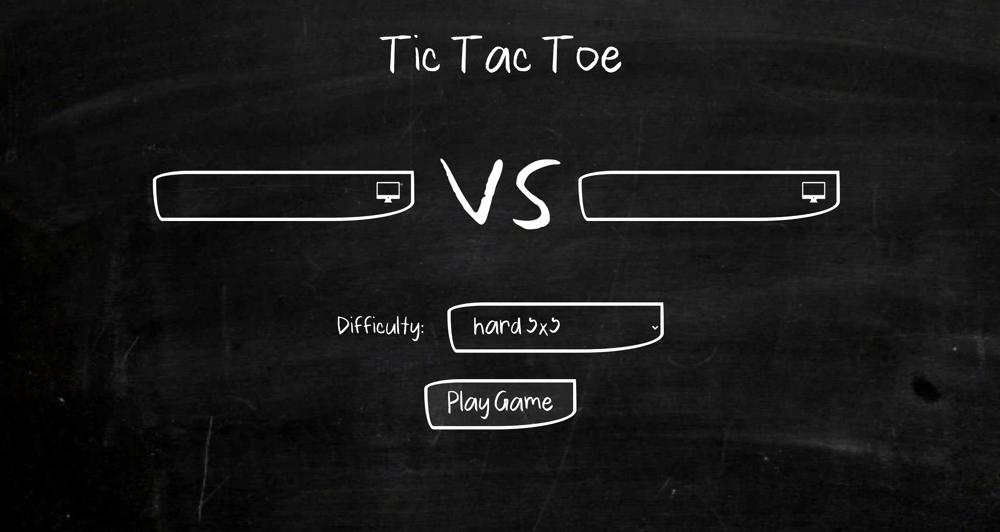
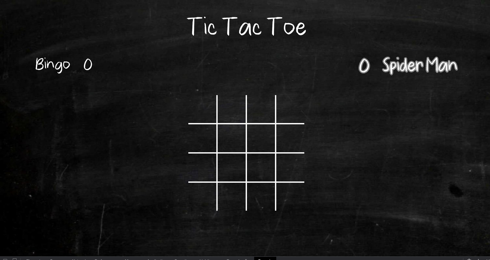
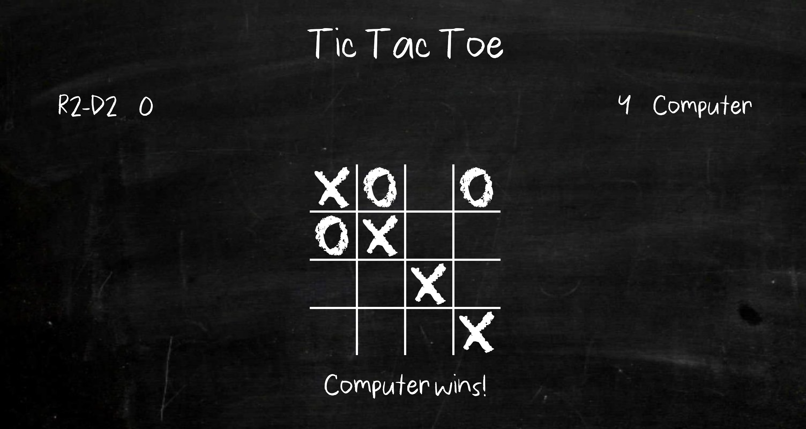
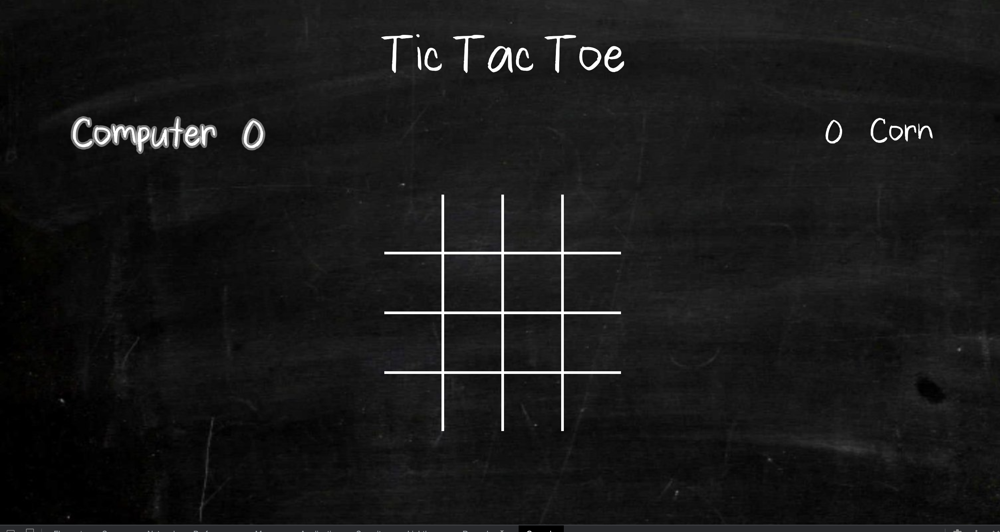

# Project 1 - Tic Tac Toe
[Play the Game](https://asbahashfaq.github.io/tic-tac-toe/)
Design and build your version of the classic game Tic Tac Toe
Theme: Throwback to old school days, when lunch time meant the chalkboard was up for grabs

#Home Screen
 
The game starts by asking player names using two input elements. 
It also allows user to select the difficulty level, using preset values, as well as manual values
When user clicks "Play Game" button, the game board is set up using the values user provided
The user can also opt to play with the computer, using the computer icon in each input element
If the user just wants to sit back and enjoy watching the game, both inputs can be set as computer. The computer will keep playing itself until the end of time...

#Game Screen
 
The game starts off with the browser setting up the grid using the settings user provided. 
Player can click on boxes to mark their choice.
Computer plays automatically.
When a turn is started, the x or o is annimated on screen using svg and clippath.
Audio is added to the strokes as well

#Computer AI
 
The computer decides which block to mark next by ranking each block based on the board state. 
Ranks are calculated separately for rows, columns and both diagonals. And then added to get the final rank.

#Results
 
The game decides when a player (or computer) wins by checking all four possiblities
- Any row is all the same 
- Any column is all the same
- Primary diagonal is all the same
- Secondary diagonal is all the same

#Problems
- Computer AI is currently not doing diagonal checks very well. 

#More To Do
- Fix problems
- Add responsiveness
- Commentify JS
- Allow changing difficulty level after going to game screen
- Implement hints for player
- Use better data structures to get rid of extra code 

